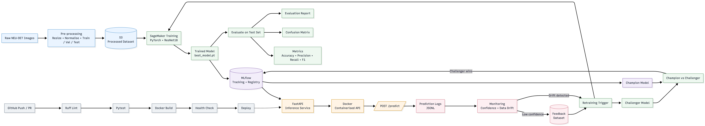
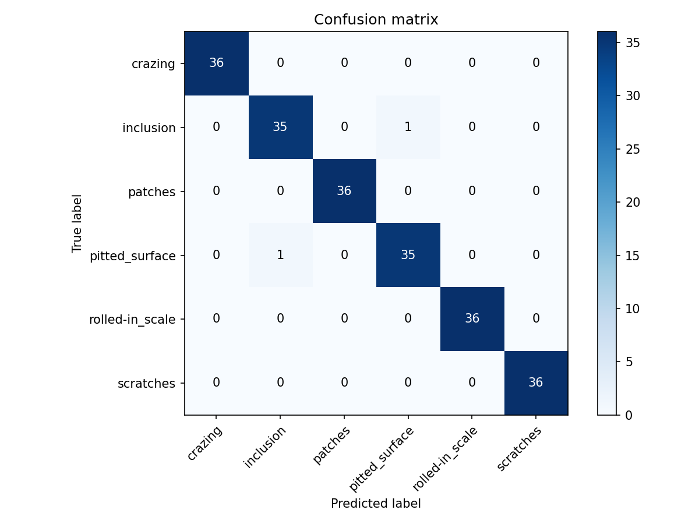

# NEU-Surface-Detect

End-to-end MLOps pipeline for **automated steel surface-defect classification**, built on the [NEU Surface Defect dataset](https://www.kaggle.com/datasets/kaustubhdikshit/neu-surface-defect-database).

The project takes the dataset from raw images through preprocessing, GPU training on AWS SageMaker, experiment tracking, model evaluation, FastAPI inference, Docker deployment, CI/CD, monitoring, and automated retraining.

The goal was to go beyond just training a CNN and saving the resulting model. I wanted to build the infrastructure around it as well, so that data, experiments, models, and predictions can all be tracked and the model can be retrained and evaluated without manually piecing everything together.

Full command sequences for each stage are in **[COMMANDS.md](COMMANDS.md)**. This README focuses on what the project does, how the pieces fit together, and some of the decisions behind it.

## Why this project exists

Steel surface defects are a useful computer-vision problem because the images are relatively small and the dataset contains several visually different defect types. It also provides a good starting point for exploring what happens around a model once it has been trained.

This project demonstrates a workflow that:

- classifies six common steel surface defects from greyscale images,
- trains the model using cloud GPU infrastructure,
- tracks experiments and model versions,
- serves predictions through a FastAPI endpoint,
- monitors predictions for signs of drift,
- and supports retraining when a new model is available.

The main idea was to build more than just the classifier. The project includes versioned data, reproducible training, experiment tracking, a model registry, an inference service, monitoring, and a retraining loop that only promotes a new model when it performs better than the current one.

## Architecture



## Results (v1, ResNet18)

| Metric | Value |
|--------|------:|
| Test accuracy | **99.07%** |
| Macro precision | 99.07% |
| Macro recall | 99.07% |
| Macro F1 | 99.07% |
| Classes | 6 |
| Processed dataset version | v1 |

The first version uses a ResNet18 with pretrained ImageNet weights. The 99.07% result is from the held-out test set.




## Defect classes

| Class | Description |
|-------|-------------|
| `crazing` | Fine cracks on the surface |
| `inclusion` | Non-metallic inclusions |
| `patches` | Patches of uneven texture |
| `pitted_surface` | Small pits or holes |
| `rolled-in_scale` | Rolled-in oxide scale |
| `scratches` | Linear scratch marks |

## Tech stack

| Layer | Tools | Why |
|-------|-------|-----|
| ML | PyTorch, torchvision, ResNet18 | ResNet18 provides a strong transfer-learning baseline without being unnecessarily large for a relatively small image dataset. |
| Cloud | AWS SageMaker, S3, IAM | Training runs on an ml.g4dn.xlarge GPU instance rather than relying on local hardware. S3 stores the processed data and training outputs used by the cloud pipeline. |
| Tracking | MLflow (experiments + model registry) | Training parameters and metrics are recorded for each run, while the model registry keeps track of model versions and which one is being considered for production. |
| API | FastAPI, Uvicorn | Provides a small, typed inference API with automatically generated OpenAPI documentation. |
| Data | Pillow, scikit-learn, pandas, NumPy | Handles image loading and preprocessing, dataset splitting, and the supporting data and evaluation work. |
| DevOps | Docker, GitHub Actions, Ruff, pytest | Docker packages the inference service, while GitHub Actions runs linting, tests, and a container health check on pushes and pull requests. |
| Monitoring | Custom drift detection + JSONL prediction logs | A lightweight custom solution was enough for a single model and endpoint, without adding the overhead of a larger monitoring platform. |

## Project structure

```text
NEU-Surface-Detect/
├── data_ingestion/     # Download, preprocess, upload to S3
├── training/           # Train, evaluate, SageMaker, MLflow, retrain
├── models/             # Checkpoints, evaluation, MLflow DB
├── inference/          # FastAPI service + Dockerfile
├── monitoring/         # Drift detection and prediction logging
├── .github/workflows/  # CI: lint, test, Docker build
├── scripts/            # Setup, MLflow UI, env checks
├── tests/              # pytest suite
├── dataset/            # Local raw/processed data (gitignored)
```

## Getting started

```bash
bash scripts/setup_env.sh
source .venv/bin/activate
python scripts/verify_env.py
```

This sets up the local environment and checks that the required dependencies are available.

For the full pipeline see **[COMMANDS.md](COMMANDS.md)**.

## Requirements

- Python 3.10 or 3.11
- macOS, Linux, or WSL
- AWS account (optional, for SageMaker training)
- Docker (optional, for containerised inference)

## CI/CD

GitHub Actions (`.github/workflows/ci.yml`) runs on every push and PR:

1. **Lint** - Ruff
2. **Test** - pytest
3. **Docker** - build image, start container, health-check `/health`
4. **Deploy** - staging/production placeholders on `main`

## Licence

See [LICENSE](LICENSE).